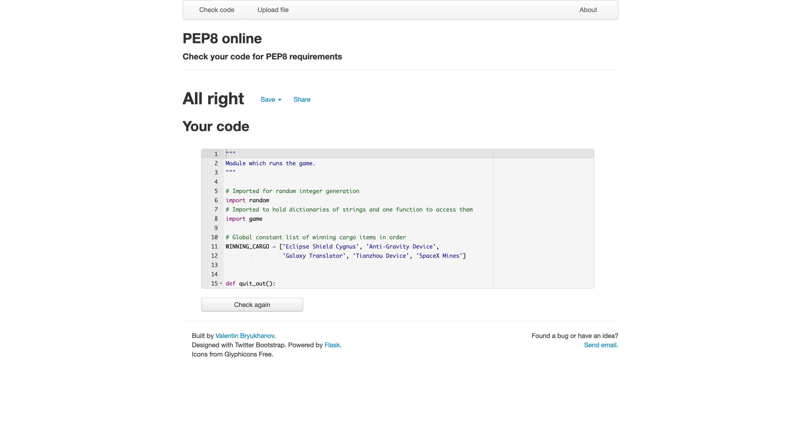

# Enter The Void

# Goal for this Project

Enter The Void is a text based adventure game in a science fiction settings. The game receives input from the user and through this the user navigates through a number of scenarios, either passing them and moving on to the next one or failing. There are five scenarios the player must navigate through by inputting commands and completing all five of them will result in the user completing the game. The user will choose the name of their captain, their spaceship and will decide upon 3 of 5 'cargo' to hold on their ship to potentially use throughout the game.

The game is simple, but is designed for people who would enjoy science fiction. The games primary enjoyment comes from passing the scenarios and reading the conclusions and also from its replayability, with 23 possible different scenario conclusions that the player can receive.

Click [here](https://enter-the-void1.herokuapp.com/) to play Enter The Void.

# Table of Contents

* [Features](#features)
    * [Start Menu](#start-menu)
    * [Create Player](#create-player)
    * [Scenario](#scenario)
    * [Victory and Game Over](#victory-and-game-over)
* [Features to be Implemented](#features-to-be-implemented)
    * [Leaderboard on Google Sheet](#leadeboard-on-google-sheet)
    * [More Methods and Cargo](#more-methods-and-cargo)
* [Data Model](#data-model)
* [Imported Modules](#imported-modules)
* [Prototype and Flowcharts](#prototype-and-flowcharts)
    * [Pseudocode flowchart](#pseudocode-flowchart)
    * [Function Flowchart](#function-flowchart)
* [Technologies Used](#technologies-used)
    * [Languages](#languages)
    * [Tools](#tools)
* [Testing](#testing)
* [Test Cases](#test-cases)
* [Bugs](#bugs)
* [Unfixed Bugs](#unfixed-bugs)
* [Deployment](#deployment)
    * [Gitpod](#gitpod)
    * [GitHub](#github)
    * [Heroku](#heroku)
* [Credits](#credits)    

# Features

* Start Menu
    * The player is taken to a start menu to begin with. Here they are prompted to choose between numbers 1-3 with details next to the numbers. 
    * If the player inputs 1 they are taken to the introduction text of the game and then to create their player object.
    * If the player inputs 2 they are taken to the instructions text and then back to the start menu.
    * If the player inputs 3 they exit the application.
    * If they input an invalid repsonse they are asked to input a valid response.

* Create Player
    * The player is asked to name their captain and their ship. The names must be between 4 and 15 alphanumeric characters without spaces and if they aren't the player is prompted to do this.
    * They are asked if these names are correct and if not this happens again in a loop but if so moves on to the player choosing what cargo they want. The player confirms their choice by responding by inputting 'Y' or 'N'. 
    * They are then asked to choose from five pieces of cargo with number inputs. The cargo list shrinks when taken from and choosing a non integer causes the game to ask the player to type an available number and typing an out of index number causes the game to tell the player what number range is available.
    * The player is asked if the cargo is good when they have selected three pieces and if the player decides they aren't the process starts again but if they are the player object is created using the captain name, ship name and the cargo chosen. The player object also has two methods which allow it to use fuel and take a chance in a scenario.  

* Scenario 
    * The player is then taken to the scenario where they are given an introductory message and are given the options of what they can do in available numbers. 
    * Choosing an incorrect option will ask the player to type an integer if they create an index error or will give the range of integers available if the players input is outside of index bounds.
    * Other than using available cargo items, the player can burn fuel (starts at 2 and decreases after every use) and take a risk with the two class methods of the player class.
    * Using the correct cargo item for the scenario clears the scenario but using the wrong one will fail it. It will also remove the cargo item from the players options.
    * Burning fuel automatically passes the scenario but if fuel is 0 or below will fail the scenario. Burning fuel also reduces fuel amount by 1 each time.
    * Taking a chance returns a random integer between 1 and 10. If the player scores higher than the scenario's 'risk factor' then they succeed otherwise they fail. Each scenario increases the risk factor by 2; so scenario 1 is a 1 and always winnable but scenario 5 is a 9 and very risky for the player.
    * Succeeding in a scenario takes you to the next scenario or victory if all scenarios are complete but failing takes you to the game over.

* Victory and Game Over
    * Whether the player achieves victory or gets a game over, they will be asked if they want to replay the game. 
    * If they choose no they will exit the application.
    * If they choose yes they will be taken back to the start menu.
    * If they choose an option that is not 'Y' or 'N' they will be asked to provide an answer that is either 'Y' or 'N' (lowercases are capitalised).

# Features to be Implemented
There are many features I could think to add to the game in order to make it better but decided not to due to the fact it would become increasingly complex.

* Leaderboard on Google Sheet
    * I had thought about storing victorious player objects on an external Google Sheet linked via API. This would also allow me to use a function to display a leaderboard which would present things like Captain Name and Ship Name of those that had completed the game. This function would get data from the Google Sheet and display it on the terminal.

* More Methods and Cargo
    * I had considered making the player object creation more complex and the cargo could have been individual objects each with weights and methods and the player class could have had more methods that could have been called in scenarios but it would have only added to the complexity of the application and with only a terminal and no visual aspect may have been needlessly confusing for the player. I could have also composed the Player class of multiple other classes. For example I could have made the Player class be made up of a Captain class, a Ship class, a Cargo class etc.

# Data Model
I created the Player class to act as my data model. 

In the game, after the player has decided to play the game at the start menu and has gone through the introductory text, they start to answer questions which create variables which are used to create an instance of the Player class. They provide a name for the name class attribute, which acts as the name for the 'captain of the ship' in the game. They provide a name for the ship_name class attribute, which acts as a 'spaceship name' in the game. Finally, they pick three items from a list of 5 called potential_cargo_items which is then used to create a list of items as a class attribute called cargo which represents a theoretical inventory of cargo in the spaceship that the player can use. The Player class model also has one attribute which is not affected by player input during creation which is the fuel attribute which is set to 2 initially.

The Player class model also has class methods which are used in the game. The first of these is the use_fuel method which reduces the fuel attribute by 1 and then returns either True or False. In game if True is returned then the scenario is cleared but if False is returned the player will fail the scenario and the game_over function will be called.  The second method of the Player class model is the take_chance method. This method takes an argument for the risk factor of a scenario (this is a factor that starts at 1 in the first scenario and increases by 2 each scenario until it reaches 9 in the final scenario) and generates a random integer from 1 to 10. If the randomly generated integer is larger than or equal to the risk factor then True will be returned and the player will pass the scenario but if it is less than the risk factor False will be returned and the player will fail the scenario.

## Imported Modules
* random
    * Python's Random Module was imported into this project in order to generate random integers for the take_chance method of the Player class which returns either True or False and decides whether the player passes a scenario or fails and gets a game over.

[Back to Top](#goal-for-this-project)

# Prototype and Flowcharts

## Pseudocode flowchart
* Here is a flowchart showing how the game functions with pseudocode.

## Function Flowchart
* Here is a flowchart showing how the game functions with specific reference to functions in use.

# Technologies Used
## Languages
* [HTML](https://en.wikipedia.org/wiki/HTML "HTML")
* [JavaScript](https://en.wikipedia.org/wiki/JavaScript "JavaScript")
* [Python](https://en.wikipedia.org/wiki/Python_(programming_language) "Python")

## Tools
* [W3C HTML Validation Service](https://validator.w3.org/ "W3C HTML")
* [pep8online](http://pep8online.com/ "pep8online")
* [GitHub](https://github.com/ "GitHub")
* [Gitpod](https://www.gitpod.io/ "Gitpod")
* [Mockup Generator](https://techsini.com/multi-mockup/index.php "Multi Device Website Mockup Generator")
* [Heroku](https://id.heroku.com/login "Heroku")
* [Figma](https://www.figma.com "Figma") 

[Back to Top](#goal-for-this-project)

# Testing

* PEP8 Validator
    * This application has been run through a PEP8 validator at [pep8online](http://pep8online.com/)

* Bug checking
    * This application has been tested to ensure that all possible scenarios are achievable and that there are no obvious bugs.
    This includes testing for index errors and value errors and making sure exception handling is done well, and that each available
    option is available when the game offers it.

## Test Cases
In this section, I discuss and explain what output should be displayed if the player gives an incorrect input 
* Start Menu Incorrect Input
    * Input: The player types and enters an input that is not '1', '2', or '3'.
    * Ouput: The console displays the words: "Invalid choice option. Please input a number between 1 and 3.", and then allows the player another go at input.

* Name and Ship Name Incorrect Input
    * Input: The player does not input a name as a string that is between 4 and 10 characters that are all alphanumeric and that does not have any spaces in.
    * Output: The console displays the words: "Name must be between 4 and 10 alphanumeric characters without spaces." and allows the player to try again.

* Is this Correct? Incorrect Input
    * Input: After inputting a valid name, ship name or cargo list the game will ask the player to confirm their choice. The player does not type in 'Y' or 'y' for yes or 'N' or 'n' for no.
    * Output: The console displays the words: "Sorry, that choice is not available.", and allows them to retry inputting a correct value.

* Cargo Choice Incorrect Input
    * Input: The player does not input a valid integer for the list of cargo items that are presented to them, between 1 and n (n being the amount of items left to choose from).
    * Output: The console displays the words: "Please choose options between 1 and n." and gives the player a chance to retype their choice.
    * Input: The player inputs something other than an integer for their choice of cargo.
    * Output: The console displays the words: "Please type your option as an available number." and gives the player a chance to retype their choice.

* Scenario Choice Incorrect Input
    * Input: The player does not input a valid integer for the list of options that are presented to them, between 1 and n (n being the number of options left to choose from).
    * Output: The console displays the words: "Please choose options between 1 and n." and gives the player a chance to retype their choice.
    * Input: The player inputs something other than an integer for their choice of cargo.
    * Output: The console displays the words: "Please type your option as an available number." and gives the player a chance to retype their choice.

* Replay Game Incorrect Input
    * Input: The player does not type in 'y' or 'Y' for yes or 'n' or 'N' for no when asked if they want to replay the game.
    * Output: The console displays the words: "Type Y for yes or N for no." and gives the player a chance to retype their choice.

[Back to Top](#goal-for-this-project)

# Bugs

Here is a list of the more significant bugs I encountered when building this project:
* Use of Python range() function incorrectly
    * Bug: In some functions (such as the validate_scenario_choice function) at first I used the range() function incorrectly as I had not understood that the second argument I provided was what the range would go up to instead of stopping on. So where there might be 4 options available typing 4 would be classed as invalid as it was outside the range I had coded.
    * Fix: This fix was simple and involved increasing the second argument for the range() function by 1.

* Creating unusable keys for SCENARIO_DICTIONARY
    * Bug: I accidentally set some of the keys in the SCENARIO_DICTIONARY to have a decimal point in them instead of a comma. This meant when the key was created in the retrieve_scenario_text function with a comma the key would not correspond with any of the key-value pairs and caused an error.
    * Fix: Changed the keys to have commas instead of decimal places.

* Incorrect grammar in text
    * Bug: The class attribute for the spaceship's name has a lowercase 'the ' at the start of it by design. However when replacing the start of sentences in strings of text in the scenario conclusions this made it look weird as this remained lowercase. For example, a sentence would read 'the Spaceship dodges' instead of 'The Spaceship dodges'.
    * Fix: Changed the grammar of the sentences so the lowercase still made sense, although using the capitalize() method probably would have worked just as well.

## Unfixed Bugs
To my knowledge there are no unfixed bugs in Enter The Void.

# Deployment

## Gitpod

The site was initially developed and tested in the terminal of Gitpod. Here are the steps I took to test the application in Gitpod:
* Type "python3 run.py" into the terminal to start the application.
* Input and enter text, numbers and strings when asked.
* Press command-c when wanting to exit the application.

## GitHub

The repository for the code was stored on GitHub. This was linked to Heroku to create the site.

## Heroku

The site was deployed to Heroku using the Code Institute's mock terminal for Heroku. Here is what I did to deploy my site to Heroku:
* Clicked on "Create new app" on Heroku account and named app and selected region as 'Europe'.
* Added PORT : 8000 to config vars in Settings.
* Added heroku/python and heroku/nodejs buildpacks in Settings (in that order).
* Connected GitHub repository for Enter The Void.
* Manually deployed main branch for Enter The Void.
* Then switched to automatic deployment of main branch after confirming manual deployment had worked.

# Credits

For code inspiration, help and advice,
* [Code Institute](https://codeinstitute.net/ie/ "Code Institute") for the deployment terminal.
* [Simen Daehlin](https://github.com/Eventyret "Simen Daehlin")
* [Free Code Camp](https://www.freecodecamp.org/learn)
* [W3Schools](https://www.w3schools.com/)
* [YouTube](https://www.youtube.com/)
* [CodePen](https://codepen.io/)

[Back to Top](#goal-for-this-project)